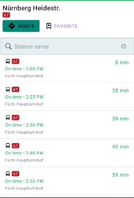

## ServiceStopMapFragment


The [`ServiceStopMapFragment`](tripkit-android/com.skedgo.tripkit.ui.map.servicestop/-service-stop-map-fragment/index.md) displays a particular scheduled service's route.

```xml
<fragment
    android:id="@+id/mapFragment"
    class="com.skedgo.tripkit.ui.map.servicestop.ServiceStopMapFragment"
    android:layout_width="match_parent"
    android:layout_height="match_parent" />
```

To tell it which route to display, call the [`setService`](tripkit-android/com.skedgo.tripkit.ui.map.servicestop/-service-stop-map-fragment/set-service.md) function with a [`TimetableEntry`](tripkit-android/com.skedgo.tripkit.ui.model/-timetable-entry/index.md), or if you are using a [TimetableFragment](stop_detail.md#TimetableFragment),
you can give the map to it and it will automatically display routes when the entries are clicked.

## TimetableFragment



The [`TimetableFragment`](tripkit-android/com.skedgo.tripkit.ui.timetables/-timetable-fragment/index.md) lists all scheduled services for a particular stop. If you pass it a [ServiceStopMapFragment](stop_detail.md#ServiceStopMapFragment),
it will automatically call `setService` when the user clicks on a particular service. You can also do that manually from a [`OnTimetableEntrySelectedListener`](tripkit-android/com.skedgo.tripkit.ui.timetables/-timetable-fragment/-on-timetable-entry-selected-listener/index.md).

Like a few of the fragments in the [Trip Results](trip_results.md), you can display your own custom buttons.

```kotlin
var timetableFragment = com.skedgo.tripkit.ui.timetables.TimetableFragment.Builder()
        .withStop(location)
        .withButton("route", R.layout.route_button)
        .withButton("favorite", R.layout.bookmark_button)
        .build()
```

When the user clicks a particular timetable entry, the [`OnTimetableEntrySelectedListener`](tripkit-android/com.skedgo.tripkit.ui.timetables/-timetable-fragment/-on-timetable-entry-selected-listener/index.md) will be called.

```kotlin
// If we add our ServiceStopMapFragment as a listener, it will automatically display a selected timetable entry.
timetableFragment.addOnTimetableEntrySelectedListener(mapFragment)
timetableFragment.addOnTimetableEntrySelectedListener { timetableEntry, scheduledStop, minStartTime ->
    // Perhaps you'd like to show the service detail now?
}
```

And when they click on any of the [`TripKitButtons`](tripkit-android/com.skedgo.tripkit.ui.model/-trip-kit-button/index.md) that you provided, the [`OnTripKitButtonClickListener`](tripkit-android/com.skedgo.tripkit.ui.timetables/-timetable-fragment/-on-trip-kit-button-click-listener/index.md) will be called.

```kotlin
timetableFragment.setOnTripButtonClickListener { id, scheduledStop ->
    if (id == "route") {
        Toast.makeText(activity, "Will route to ${scheduledStop.displayAddress}", Toast.LENGTH_SHORT).show()
    } else if (id == "favorite") {
        Toast.makeText(activity, "Will favorite ${scheduledStop.nameOrApproximateAddress}", Toast.LENGTH_SHORT).show()
    }
}
```

## ServiceDetailFragment


To show the details about a particular service, you can use the [`ServiceDetailFragment`](tripkit-android/com.skedgo.tripkit.ui.servicedetail/-service-detail-fragment/index.md) which shows the entire scheduled
service line.  If you pass it a [ServiceStopMapFragment](stop_detail.md#ServiceStopMapFragment),
it will automatically have the map move and zoom in on the scheduled stop that a user clicks on.

You'll need to pass it a [`TimetableEntry`](tripkit-android/com.skedgo.tripkit.ui.model/-timetable-entry/index.md) and a [`ScheduledStop`](tripkit-android/com.skedgo.tripkit.common.model/-scheduled-stop/index.md).

```kotlin
var fragment = ServiceDetailFragment.Builder()
                .withTimetableEntry(timetableEntry)
                .withStop(scheduledStop)
                .build()
```

You can then add [`OnScheduledStopClickListeners`](tripkit-android/com.skedgo.tripkit.ui.servicedetail/-service-detail-fragment/-on-scheduled-stop-click-listener/index.md) to handle users clicking on individual stops.

```kotlin
        fragment.addOnScheduledStopClickListener(mapFragment)
        fragment.addOnScheduledStopClickListener {
            // You could collapse a bottom sheet, for example.
        }
```
